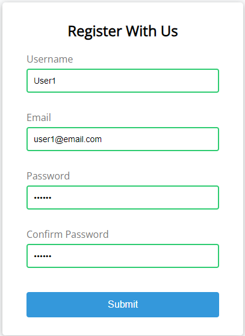

## 📝 Form Validator (Intro Project)

This project demonstrates simple client-side form validation. It checks for required fields, validates input lengths, email format, and ensures that passwords match.

---

## 📋 Project Specifications

- **Form UI**: A user-friendly interface for the form.
- **Error Messages**: Display error messages directly under the respective input fields for better clarity.
- **Validation Functions**:
  - `checkRequired()`: Ensures that specified fields are not left empty.
  - `checkLength()`: Validates the minimum and maximum length for inputs (e.g., username or password).
  - `checkEmail()`: Validates the email format using regular expressions (regex).
  - `checkPasswordsMatch()`: Ensures that the password and confirmation password fields match.

---

## 🖼️ Project Preview

Check out how the form validation looks in action! This form provides immediate feedback to users when they attempt to submit the form with incorrect or missing information.

---

This introductory project sets the foundation for more complex client-side validation systems, improving form usability and user experience.
