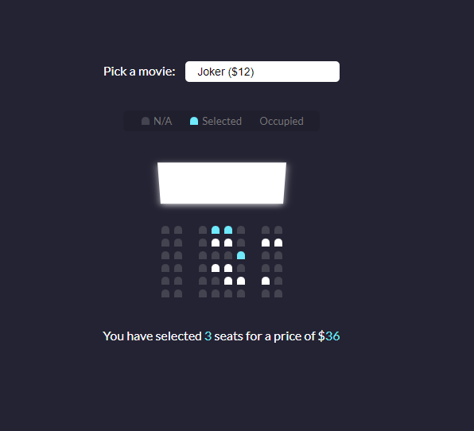

## 🎬 Movie Seat Booking (Project Overview)

This project simulates a movie theater seat booking system. Users can select a movie, choose available seats, and see the total price dynamically update as they select or deselect seats.

---

## 📋 Project Specifications

- **Interactive UI**: Displays the movie selection, screen, seats, and a legend to guide users.
- **Movie Selection**: Users can choose from different movie options, each with its own price.
- **Seat Selection**: Users can select and deselect seats, except for those marked as occupied.
- **Dynamic Updates**: The number of selected seats and the total ticket price are updated in real-time as selections are made.
- **Persistent Data**: User selections (seats, movie, and price) are stored in `localStorage` to ensure the UI is populated with saved data upon page reload.

---

## 🖼️ Project Preview

  

Take a look at how the movie seat booking interface functions in practice! Seats can be selected, and the total price is updated instantly. Plus, the user’s choices remain saved even after refreshing the page.

---

This project provides a foundation for implementing interactive features and state persistence, key elements for building modern web applications.
